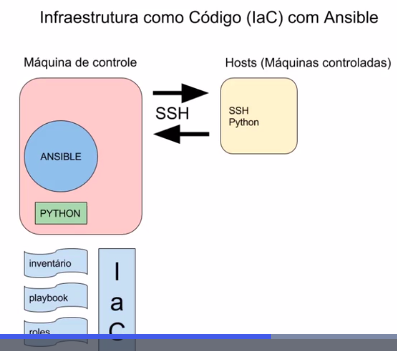

# Geral
O Ansible é uma ferramenta amplamente utilizada para gerenciamento de configuração.

A seguir destaco alguns componentes do Ansible:

_Fonte da imagem: [Ansible - Implementando sua infraestrutura como código](https://www.alura.com.br/curso-online-ansible-implementando-infraestrutura-codigo)_

## Inventário
O inventário é um arquivo que lista todas as máquinas gerenciadas pelo Ansible. Ele pode ser definido de forma estática ou dinâmica. Esse arquivo permite classificar os hosts em grupos.

## Playbook
Através de um arquivo YAML, um conjunto de tarefas será executado em um ou mais hosts pelo playbook. Essa abordagem permite a automação de processos complexos de forma organizada e reutilizável.

## Roles
Os roles permitem a modularização do código no Ansible, organizando tarefas em componentes reutilizáveis e bem estruturados.

# Conclusão
O Ansible se destaca por sua simplicidade e eficiência, reduzindo o esforço manual, eliminando erros operacionais e acelerando a automação de infraestrutura. Com sua estrutura modular e flexível, é possível gerenciar ambientes complexos de forma ágil e escalável.